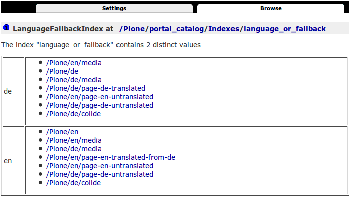

.. This README is meant for consumption by humans and pypi. Pypi can render rst files so please do not use Sphinx features.
   If you want to learn more about writing documentation, please check out: http://docs.plone.org/about/documentation_styleguide.html
   This text does not appear on pypi or github. It is a comment.

==============================================================================
plone.app.multilingualindexes
==============================================================================

Indexes optimized to query multilingual content made with plone.app.multilingual.

Features
--------

``tgpath`` Index (Translation Group Path)
    Utility and index to get the path of an item as UUIDs of its translationgroup.

``language_or_fallback`` Index
    Index to query items and get one fallback if not available in the current language.
    Fallbacks can be configured in control-panel and are stored in the registry.

Integration with ``Collections``
    Both indexes are available in Collections and other places using ``plone.app.querystring`` under the hood.
    If the ``tgpath`` or ``language_or_fallback`` is used in a Collection, the ``path`` will be set to the portal.
    Thus the usal automatically added fixation to the current ``INavigationRoot`` wont be set,
    because language root folders are navigation roots.

Installation
------------

Install plone.app.multilingualindexes by adding it to your buildout::

    [buildout]

    ...

    eggs =
        plone.app.multilingualindexes

and then running ``bin/buildout``

Contribute
----------

- Issue Tracker: https://github.com/plone/plone.app.multilingualindexes/issues
- Source Code: https://github.com/plone/plone.app.multilingualindexes

License
-------

The project is licensed under the GPLv2.
